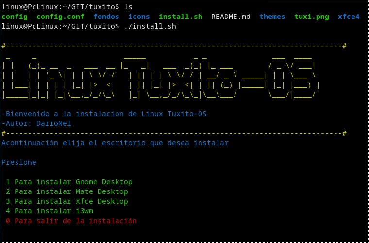
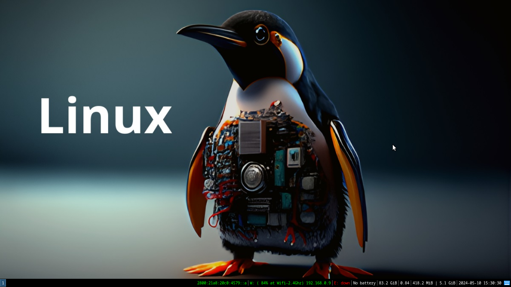
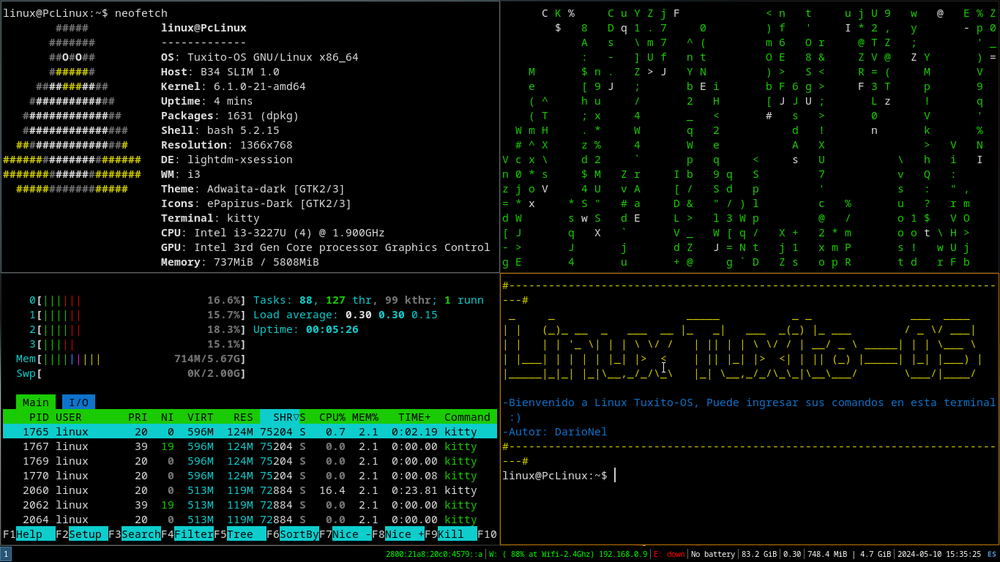

# Linux Tuxito OS es un script para instalar un entorno de escritorio minimo.

# Autor: DarioNel

# Fecha de Creación 03-03-2024 10-05-2024

# Para instalar debe ingresar a :

cd tuxito                    # Ingresar al directorio tuxito
sudo chmod +x install.sh     # Dar permisos de ejecición
./install.sh                 # Ejecutar el scrpit
# Menu de instalación

# Gestor de ventanas i3

# Terminal kitty i3wm

# Atajos de Teclado para i3wm
Ctrl + Shift + 1              # Apagar 
Ctrl + Shift + 2              # Reiniciar
$mod + Shift + e              # Cambiar de usuario
$mod + Shift + r              # Guardar configuracion
Ctrl + q                      # Cerrar

$mod + d                      # Abrir el menu de aplicaciones Rofi
$mod + numeros                # Abrir escritorios virtuales
$mod + <-    (flecha)         # mover la ventana hacia la izquierda
$mod + ->    (flecha)         # mover la ventana hacia la derecha
$mod + Shift + barra espa     # Hacer una ventana flotante
$mod + mouse + click izq      # Mover la ventana flotante
$mod + mouse + click der      # Cambiar el tamaño de la ventana
$mod + r + -> <- (flechas)    # modo rezize cambiar tamaño de ventana
$mod + f                      # Maximizar una ventana 
$mod + w                      # Poner las ventanas en pestañas
$mod + s                      # Poner las ventanas en pestañas hacia abajo
$mod + r                      # Dividir las ventanas por la midad de la pantalla
$mod + enter                  # Abrir Terminal
$mod + h                      # Abrir ventanas horizontal
$mod + v                      # Abrir ventanas vertical
$mod + t                      # Abrir gestor de archivos thunar
$mod + n                      # Abrir el navegador firefox
$mod + p                      # Abrir control volumen pavucontrol
